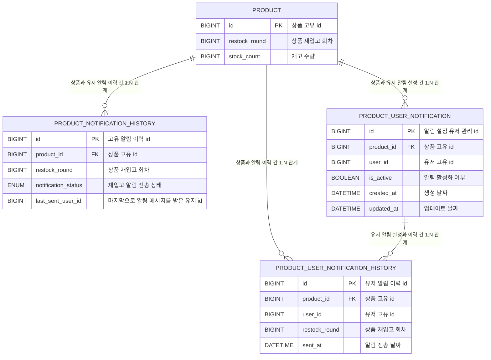

**[ ERD ]**

```mermaid
erDiagram
    PRODUCT {
        BIGINT id PK "상품 고유 id"
        BIGINT restock_round "상품 재입고 회차"
        BIGINT stock_count "재고 수량"
    }

    PRODUCT_NOTIFICATION_HISTORY {
        BIGINT id PK "고유 알림 이력 id"
        BIGINT product_id FK "상품 고유 id"
        BIGINT restock_round "상품 재입고 회차"
        ENUM notification_status "재입고 알림 전송 상태"
        BIGINT last_sent_user_id "마지막으로 알림 메시지를 받은 유저 id"
    }
    
    PRODUCT_USER_NOTIFICATION {
        BIGINT id PK "알림 설정 유저 관리 id"
        BIGINT product_id FK "상품 고유 id"
        BIGINT user_id "유저 고유 id"
        BOOLEAN is_active "알림 활성화 여부"
        DATETIME created_at "생성 날짜"
        DATETIME updated_at "업데이트 날짜"
    }

    PRODUCT_USER_NOTIFICATION_HISTORY {
        BIGINT id PK "유저 알림 이력 id"
        BIGINT product_id FK "상품 고유 id"
        BIGINT user_id "유저 고유 id"
        BIGINT restock_round "상품 재입고 회차"
        DATETIME sent_at "알림 전송 날짜"
    }
    
    PRODUCT ||--o{ PRODUCT_NOTIFICATION_HISTORY : "상품과 유저 알림 이력 간 1:N 관계"
    PRODUCT ||--o{ PRODUCT_USER_NOTIFICATION : "상품과 유저 알림 설정 간 1:N 관계"
    PRODUCT ||--o{ PRODUCT_USER_NOTIFICATION_HISTORY : "상품과 알림 이력 간 1:N 관계"
    PRODUCT_USER_NOTIFICATION ||--o{ PRODUCT_USER_NOTIFICATION_HISTORY : "유저 알림 설정과 이력 간 1:N 관계"
```