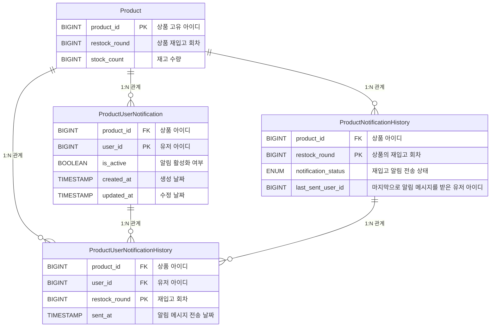

**[ ERD ]**

```mermaid
erDiagram
    Product {
        BIGINT product_id PK "상품 고유 아이디"
        BIGINT restock_round "상품 재입고 회차"
        BIGINT stock_count "재고 수량"
    }

    ProductNotificationHistory {
        BIGINT product_id FK "상품 아이디"
        BIGINT restock_round PK "상품의 재입고 회차"
        ENUM notification_status "재입고 알림 전송 상태"
        BIGINT last_sent_user_id "마지막으로 알림 메시지를 받은 유저 아이디"
    }
    Product ||--o{ ProductNotificationHistory : "1:N 관계"

    ProductUserNotification {
        BIGINT product_id FK "상품 아이디"
        BIGINT user_id PK "유저 아이디"
        BOOLEAN is_active "알림 활성화 여부"
        TIMESTAMP created_at "생성 날짜"
        TIMESTAMP updated_at "수정 날짜"
    }
    Product ||--o{ ProductUserNotification : "1:N 관계"

    ProductUserNotificationHistory {
        BIGINT product_id FK "상품 아이디"
        BIGINT user_id FK "유저 아이디"
        BIGINT restock_round PK "재입고 회차"
        TIMESTAMP sent_at "알림 메시지 전송 날짜"
    }
    Product ||--o{ ProductUserNotificationHistory : "1:N 관계"
    ProductUserNotification ||--o{ ProductUserNotificationHistory : "1:N 관계"
    ProductNotificationHistory ||--o{ ProductUserNotificationHistory : "1:N 관계"
```